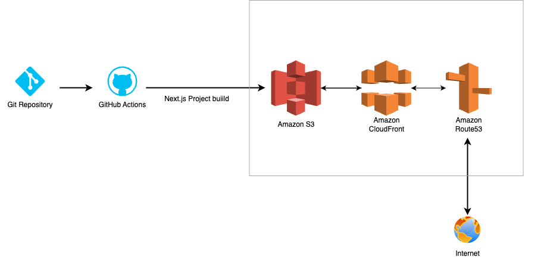
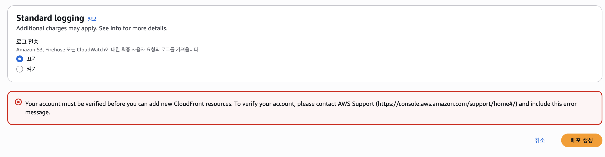
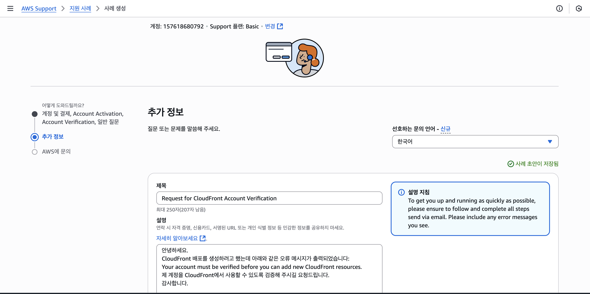
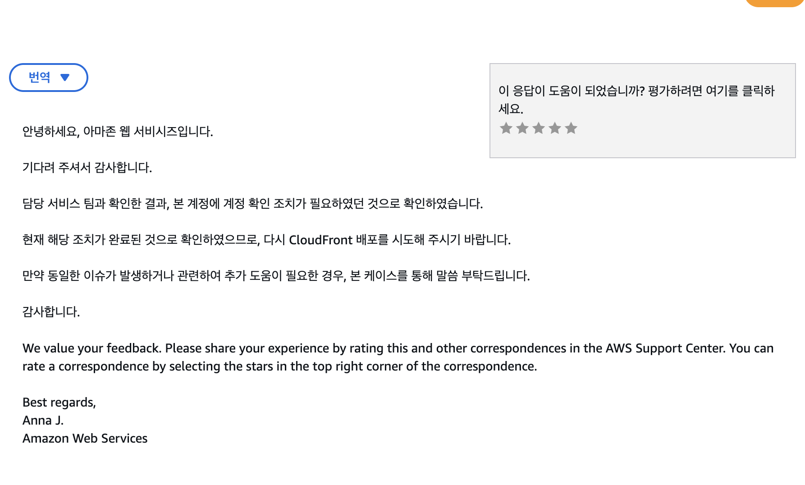
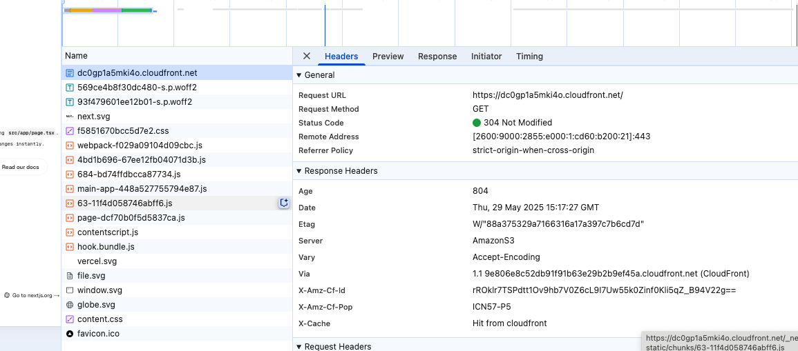
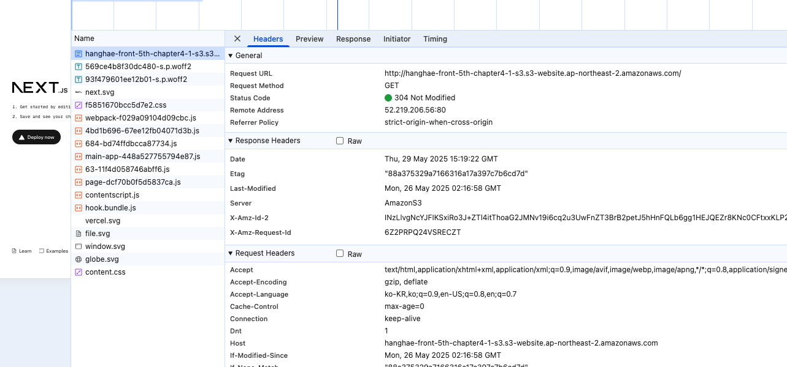

# 프론트엔드 배포 파이프라인

<!-- - 과제 팁1: 다이어그램 작성엔 Draw.io, Lucidchart 등을 이용합니다.
- 과제 팁2: 새로운 프로젝트 진행시, 프론트엔드팀 리더는 예시에 있는 다이어그램을 준비한 후, 전사 회의에 들어가 발표하게 됩니다. 미리 팀장이 되었다 생각하고 아키텍쳐를 도식화 하는걸 연습해봅시다.
- 과제 팁3: 캐시 무효화는 배포와 장애 대응에 중요한 개념입니다. `.github/workflows/deployment.yml` 에서 캐시 무효화가 어떤 시점에 동작하는지 보고, 추가 리서치를 통해 반드시 개념을 이해하고 넘어갑시다.
- 과제 팁4: 상용 프로젝트에선 DNS 서비스가 필요합니다. 도메인 구입이 필요해 본 과제에선 ‘Route53’을 붙이는걸 하지 않았지만, 실무에선 다음과 같은 인프라 구성이 필요하다는걸 알아둡시다. -->

## 개요



GitHub Actions에 워크플로우를 작성해 다음과 같이 배포가 진행되도록 합니다.

 (사전작업: Ubuntu 최신 버전 설치)

1. Checkout 액션을 사용해 코드 내려받기
2. `npm ci` 명령어로 프로젝트 의존성 설치
3. `npm run build` 명령어로 Next.js 프로젝트 빌드
4. AWS 자격 증명 구성
5. 빌드된 파일을 S3 버킷에 동기화
6. CloudFront 캐시 무효화

## 주요 링크

- S3 버킷 웹사이트 엔드포인트: http://hanghae-front-5th-chapter4-1-s3.s3-website.ap-northeast-2.amazonaws.com
- CloudFrount 배포 도메인 이름: https://dc0gp1a5mki4o.cloudfront.net

## 주요 개념

### Github Actions와 CI/CD 도구

#### 개요
GitHub Actions는 GitHub 저장소에서 자동화된 워크플로우를 구축할 수 있는 CI/CD 도구입니다.  
코드가 특정 브랜치에 push되거나 Pull Request가 생성될 때, 정해진 스크립트를 자동으로 실행할 수 있도록 합니다.  
대표적인 활용 사례는 테스트 자동화, 빌드, 배포, 코드 포맷팅 및 린팅입니다.  
GitHub Actions는 YAML 형식의 설정 파일(`.github/workflows/`)을 통해 정의되며, 다양한 공식 액션과 서드파티 액션을 조합해 유연한 파이프라인 구성이 가능합니다.

#### 주요 기능
- 다양한 이벤트 트리거: `push`, `pull_request`, `schedule` 등  
- 다양한 OS 환경에서 실행 가능 (Ubuntu, macOS, Windows)  
- Secret 관리 및 환경변수 설정 지원  
- GitHub Marketplace에서 수천 개의 커뮤니티 액션 사용 가능

#### 기타 CI/CD 도구와의 비교
Jenkins, GitLab CI, CircleCI 등과 달리 GitHub Actions는 GitHub 플랫폼에 통합되어 있어 설정이 간편하고 리포지토리 기반으로 관리됩니다.  
단, 복잡한 파이프라인 관리나 분산 빌드에는 Jenkins나 GitLab이 더 적합할 수 있습니다.

#### 예시 워크플로우
`.github/workflows/` 폴더 내 `.yml` 파일을 통해 아래와 같은 자동화 시나리오를 구성할 수 있습니다.  
아래는 Next.js 프로젝트를 빌드하여 S3에 배포하고 CloudFront 캐시를 무효화하는 예시입니다:

```yml
# 워크플로우의 이름을 정의합니다
name: Deploy Next.js to S3 and invalidate CloudFront

# 워크플로우가 실행되는 조건을 정의합니다
on:
  # main 브랜치에 push가 발생할 때 실행됩니다
  push:
    branches:
      - main  # 또는 master, 프로젝트의 기본 브랜치 이름에 맞게 조정
  # GitHub Actions UI에서 수동으로 실행할 수 있게 합니다
  workflow_dispatch:

# 실행할 작업들을 정의합니다
jobs:
  # deploy라는 이름의 작업을 정의합니다
  deploy:
    # Ubuntu 최신 버전에서 실행합니다
    runs-on: ubuntu-latest
    
    # 작업의 각 단계를 정의합니다
    steps:
    # 1. 저장소의 코드를 체크아웃합니다
    - name: Checkout repository
      uses: actions/checkout@v4

    # 2. 프로젝트의 의존성 패키지들을 설치합니다
    - name: Install dependencies
      run: npm ci

    # 3. Next.js 프로젝트를 빌드합니다
    - name: Build
      run: npm run build

    # 4. AWS 자격 증명을 설정합니다
    - name: Configure AWS credentials
      uses: aws-actions/configure-aws-credentials@v1
      with:
        # GitHub Secrets에서 AWS 접근 키를 가져옵니다
        aws-access-key-id: ${{ secrets.AWS_ACCESS_KEY_ID }}
        aws-secret-access-key: ${{ secrets.AWS_SECRET_ACCESS_KEY }}
        aws-region: ${{ secrets.AWS_REGION }}

    # 5. 빌드된 파일들을 S3 버킷에 동기화합니다
    - name: Deploy to S3
      run: |
        aws s3 sync out/ s3://${{ secrets.S3_BUCKET_NAME }} --delete

    # 6. CloudFront의 캐시를 무효화하여 새로운 내용이 바로 반영되도록 합니다
    - name: Invalidate CloudFront cache
      run: |
        aws cloudfront create-invalidation --distribution-id ${{ secrets.CLOUDFRONT_DISTRIBUTION_ID }} --paths "/*"
```

#### 출처
- GitHub Actions 공식 문서: https://docs.github.com/en/actions

---

### S3와 스토리지 

#### 개요
Amazon S3(Simple Storage Service)는 AWS에서 제공하는 객체 기반 스토리지 서비스입니다.  
정적 웹사이트 호스팅, 백업, 로그 저장, 데이터 아카이빙 등 다양한 용도로 활용됩니다.  
각 객체는 "버킷(bucket)"이라는 컨테이너에 저장됩니다.

#### 주요 특징
- **내구성**: 99.999999999%(11 9s)  
- **가용성**: 전 세계에서 고가용성으로 접근 가능  
- **무제한 용량**: 유연한 확장  
- **정적 웹 호스팅**: HTML/CSS/JS 등 정적 자산 배포  
- **버전 관리**: 객체 변경/삭제 이력 보관 가능

#### 활용 예시
S3 버킷에 `index.html`, `error.html`을 설정하고 퍼블릭 액세스를 허용하면 정적 사이트 호스팅이 가능합니다.  
CloudFront와 함께 사용 시 성능과 보안 향상됩니다.

#### 출처
- https://docs.aws.amazon.com/s3

---

### CloudFront와 CDN

#### 개요
Amazon CloudFront는 AWS의 글로벌 CDN(콘텐츠 전송 네트워크) 서비스입니다.  
정적/동적 콘텐츠를 사용자 지리적으로 가까운 엣지 로케이션에서 제공해 빠른 응답 속도를 보장합니다.

#### 주요 기능
- **엣지 로케이션**: 전 세계 분산 서버  
- **오리진 연결**: S3, EC2, API Gateway 등  
- **HTTPS/보안**: SSL 인증서, 암호화된 트래픽  
- **Signed URL/Cookie**: 제한적 접근 제어  
- **Lambda@Edge**: 엣지에서 코드 실행 가능

#### 활용 예시
정적 자산은 S3에, API 요청은 API Gateway에, 전체 트래픽은 CloudFront를 통해 빠르고 안전하게 처리할 수 있습니다.

#### 출처
- https://docs.aws.amazon.com/cloudfront

---

### 캐시 무효화(Cache Invalidation)

#### 개요
CloudFront는 콘텐츠를 캐시해 빠른 응답을 제공하지만, 콘텐츠가 업데이트되면 캐시 무효화 처리가 필요합니다.

#### 방법
1. **Invalidation API/콘솔 사용**  
   - `/*`, `/index.html` 등 경로 지정  
   - 수 분 소요, 월 1,000건 무료

2. **버전 쿼리/파일명 변경**  
   - 예: `style.css?v=2`  
   - 새로고침 효과를 얻을 수 있으나 관리 복잡성 존재

#### 팁
- 자주 변경되는 파일 → `Cache-Control: no-cache` + 버전 쿼리  
- 변경이 드문 파일 → `max-age` 조정하여 캐싱 유지

#### 출처
- https://docs.aws.amazon.com/AmazonCloudFront/latest/DeveloperGuide/Invalidation.html

---

### Repository secret과 환경변수

#### 개요
CI/CD 파이프라인에서는 민감 정보(API 키, 배포 토큰 등)를 코드에 하드코딩하지 않고 환경변수 또는 Repository Secret으로 관리합니다.

#### 환경변수 종류
- **Repository secrets**: 리포지토리 단위  
- **Environment secrets**: 환경 단위 공통 적용  
- **Encrypted secrets**: GitHub에서 자동 암호화

#### 사용 예시

```yaml
복사
편집
env:
  S3_BUCKET: ${{ secrets.S3_BUCKET }}
```
또는 직접 명령어에 인라인으로 삽입:

```yaml
복사
편집
aws s3 sync ./build s3://${{ secrets.S3_BUCKET }}
```
#### 보안 팁
- 민감 정보는 절대 코드에 직접 입력 X  
- CI 로그에 노출되지 않도록 주의  
- 최소 권한 원칙(Least Privilege) 적용

#### 출처
- https://docs.github.com/en/actions/security-guides/encrypted-secrets


<!-- s3와 cloudfront 비교 -->

## 후기

### CloudFront 관련 계정 권한 해결

이번 과제는 잊고 지냈던 개인 AWS 계정을 다시 찾는 일부터 시작됐습니다.
회사에 있을 땐 부여받은 업무용 계정만 사용했기 때문에, 개인 계정은 한동안 사용하지 않았습니다. 이번 과제를 진행하면서 비로소 잊고 있던 비밀번호를 찾아내고, 계정을 복구하게 됐습니다.

S3에 과제용 버킷을 생성하고, `CloudFront` 의 배포를 생성하는 과정에서 아래와 같은 문구와 함께 에러가 발생했습니다.
구글링을 통해 다른 사람들도 흔히 겪는 문제임이 확인됐고, 결론은 권한이 없다는 것이었습니다.



해결 방법은 관련 내용에 대해서 `AWS Support` 에 해당 내용에 대해서 문의하는 것입니다.



최대 1~2일이 걸린다는 말도 있었지만, 당일에 바로 회신이 왔습니다.



그리고 이후에는 정상적으로 진행할 수 있었습니다!

## CDN 성능 최적화(심화)
<!-- (CDN 도입 전과 도입 후의 성능 개선 보고서 작성) -->
<!-- - 과제 팁1 : CDN 도입후 성능 개선 보고서 영역은 [프론트엔드 개발자를 위한 CloudFront ](https://www.notion.so/CloudFront-2c0653cb130f42b2b21078389511cca2?pvs=21)에서 네트워크 탭을 비교한 영역을 참고해주세요. **이미지와 수치등을 표로 정리**해서 보여주면 가독성이 높은 보고서가 됩니다.
- 과제 팁2 : 저장소 → 스토리지 → CDN을 통해 정적파일을 배포하는 방식을 이해하지 못하면 다양한 기술 문서를 이해하지 못합니다. [링크](https://toss.tech/article/engineering-note-9)로 첨부한 문서를 보고 실무에서 이런 네트워크 지식이 어떻게 쓰이는지 맛보기 해보세요. -->

CloudFront에 대해서 알아보면서 CDN에 대해서 짧게 알아봤고, 한번더 짚고 넘어가보는 시간을 가져보겠습니다.
앞서 Next.js 프로젝트를 각각 s3, cloudFront를 통해 배포했는데 두 버전의 성능을 비교해보겠습니다.

### CDN이란?

CDN은 **콘텐츠 전송 네트워크(Content Delivery Network)**로, 사용자에게 **정적 리소스**(이미지, JS, CSS, 영상 등)를 빠르고 안정적으로 제공하기 위해 전 세계 여러 지역에 분산된 **엣지 서버(Edge Server)**를 통해 콘텐츠를 전달하는 구조입니다.

CDN은 콘텐츠를 캐싱하여 **응답 속도 향상**, **트래픽 분산**, **보안 강화** 등을 실현할 수 있어, 사용자 경험을 크게 개선하는 핵심 인프라입니다.

### 작동 원리

1. 사용자가 콘텐츠 요청
2. DNS가 사용자 위치에 가까운 CDN 엣지 서버로 연결
3. 엣지 서버가 캐시를 확인  
   - 있으면: 캐시된 콘텐츠 응답  
   - 없으면: 원본 서버(origin)에서 가져와 캐시 저장 후 응답
4. 이후 동일 요청 시 캐시된 콘텐츠 제공


### S3 vs CloudFront 버전

작업관리자 창의 네트워크 탭의 응답헤더를 비교해보면 
- CloudFront의 경우 `X-Cache: Hit from cloudfront` 라는 헤더가 붙고
- 컨텐츠가 압축되어 서빙된다


 
S3의 경우를 보면 같은 컨텐츠임에도 압축이 되어있지 않는 것을 확인할 수 있다
- `Content-Encoding` 헤더 없음
  



### 참고
- [프론트엔드 배포 시스템의 진화 (1) - 결제 SDK에 카나리 배포 적용하기](https://toss.tech/article/engineering-note-9)